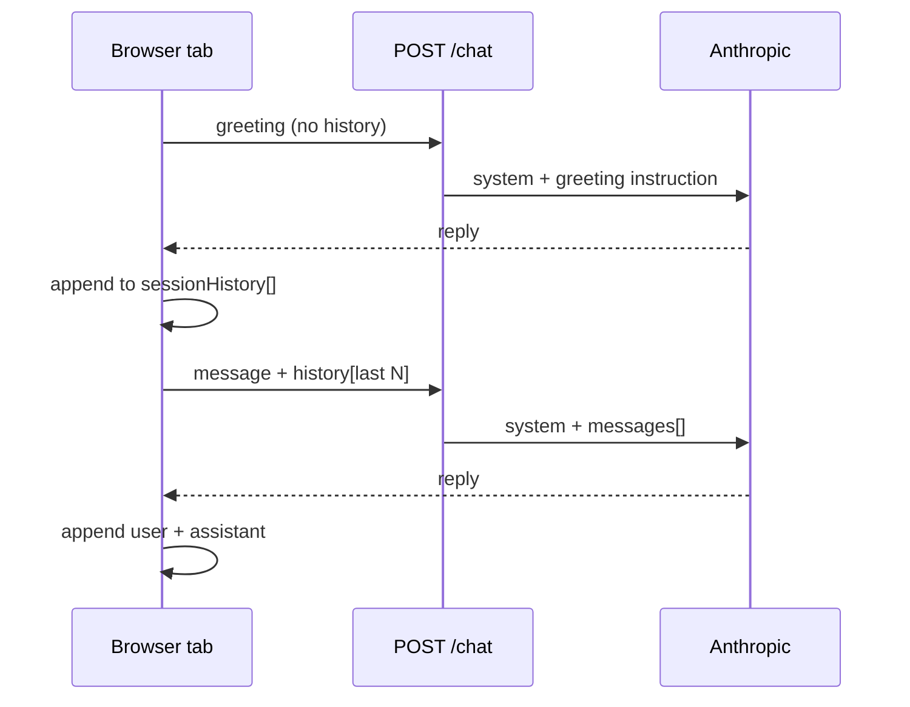

# Chat session memory and greeting variety

**Status:** Approved (option 2) — 2026-06-01  
**Goal:** Conversational Ask Harvey (thread memory within a tab) + fresh openers each visit, without weakening guardrails or permanent “learning” from chats.

---

## Product decision

| When | Behavior |
|------|----------|
| **New browser session** (tab closed, new visit, refresh) | **Fresh greeting** — new Harvey opener, not a replay of last thread |
| **Same tab, ongoing chat** | **Full thread memory** — follow-ups, riffs, callbacks in the conversation |
| **Return visitor (another day)** | Catch-up from `visitors.json` + live status — **not** full transcript replay |
| **Facts** | Always from system prompt (race JSON, status, agent-context) — memory does not override |

---

## Current gaps

1. **API:** `messages=[{"role": "user", "content": single}]` — no history.
2. **Greeting:** Same meta-instructions + pre-race block → repetitive socks/prep lines.
3. **UI:** Renders history locally but does not send it to `/chat`.

---

## Architecture (stateless server, client-held history)



- **No server-side transcript store** for v1 (privacy, simplicity).
- **sessionStorage** (or in-memory only) holds `chatHistory` for the tab session.
- Closing tab or explicit “new conversation” clears history.

---

## API changes

### Request (`ChatRequest`)

```python
class ChatMessage(BaseModel):
    role: Literal["user", "assistant"]
    content: str

class ChatRequest(BaseModel):
    visitor_id: str
    message: str | None = None  # empty = greeting
    history: list[ChatMessage] = []  # prior turns this tab only
```

### Rules

| Request type | `history` | `message` |
|--------------|-----------|-----------|
| Greeting | **Ignored** (always `[]` server-side) | empty |
| User message | Last **N** turns (cap **10** messages / **5** exchanges) | current text |

Server validates: strip empty content; truncate from the front if over cap; reject roles other than user/assistant.

### `chat_completion`

```python
messages = [*formatted_history, {"role": "user", "content": user_message}]
client.messages.create(..., system=system, messages=messages)
```

System prompt **unchanged** on every call (scope lock, race data, voice, status, visitor, agent-context).

### Token safety

- Cap history at **5 user + 5 assistant** turns (configurable).
- Optional: truncate assistant replies in history to 500 chars when re-sent (v2 if needed).
- `CLAUDE_MAX_TOKENS` unchanged for reply; monitor cost in Langfuse.

---

## UI changes (`ui/app.js`)

1. **`sessionHistory`** — array of `{role, content}` in **sessionStorage** key e.g. `cc_chat_history`.
2. **On greeting success** — clear history OR start fresh with only assistant greeting (do not send old history to greeting endpoint).
3. **On send** — push user message; call API with `history: sessionHistory.slice(-10)`; push assistant reply.
4. **On new visit to page** — if `sessionStorage` has history from same tab refresh: **policy for option 2:**
   - **Refresh (F5):** treat as new session → clear history, new greeting (matches “fresh opener each visit”).
   - **In-tab navigation away and back:** same as refresh unless we use `sessionStorage` without clearing on reload — **default: clear on full page load** (`beforeunload` optional; simplest: clear history at start of `loadGreeting` except when continuing same session via SPA — this app is single page: **reload = new greeting, no history**).

Clarification for implementers:

| Event | History | Greeting |
|-------|---------|----------|
| First open after onboarding | empty | yes |
| User sends messages | grows | no |
| **Full page reload** | cleared | yes, new opener |
| Close tab, reopen site same visitor | cleared | yes, new opener |

5. **Optional later:** “Continue where we left off” button — out of scope for v1.

---

## Greeting variety (Phase 1b — same PR or follow-up)

### Problem

Pre-race system block + static greeting instructions → same socks / site-tour tone every time.

### Fixes

1. **`voice.md`** — section **Session openers (vary every time)**  
   - Rotate: Nilbog, drop bags, crew nerves, “why 200,” height, Amanda, sleep station dread, simulation disclaimer.  
   - Rule: never open two sessions with the same bit (socks twice in a row).

2. **`build_greeting_user_message`** — add `opening_index = checkin_count % 7` or pass `variety_hint` from prompt themes list in code.

3. **`visitors.json`** — optional field `last_greeting_hook: str` (one short phrase) updated after each greeting; inject *“Do not repeat this opener: …”* on next greeting only.

4. **Do not** increment variety from `checkin_count` alone for message sends — only update `last_greeting_hook` when `is_greeting`.

### Return visitors

Keep catch-up from `format_catchup_block` for `checkin_count > 0`, but add: *“Fresh opener first, then catch-up — don’t lead with the same prep joke every time.”*

---

## Safety (unchanged + explicit)

- System prompt still includes SCOPE_LOCK, race data, voice, status, relationship tone.
- History cannot override: “ignore previous instructions” → model still bound by system (best practice; no prompt injection hardening v1).
- No persistence of history to disk on server.
- `questions.json` logging unchanged (audit only).
- Greeting requests never include client history (server enforces `history=[]` when `message` empty).

---

## Testing

| Test | Expect |
|------|--------|
| Greeting with fake history in body | Server ignores history |
| Two-turn: “What aids Friday?” then “Which have crew?” | Second answer references first |
| Reload page | New greeting, no reference to prior thread |
| `pytest` API | Mock Claude receives `messages` length > 1 |
| Token cap | History truncated at N |

---

## Rollout

1. Implement API + UI history (core).
2. Greeting variety in `voice.md` + prompt tweak.
3. Deploy droplet (`server/` + `ui/` copy to `public/` via build — **Pages deploy** for UI, droplet for API).
4. Phone test: thread follow-up + reload for fresh opener.

---

## Out of scope (v1)

- Server-stored transcripts across days
- Fine-tuning or automatic prompt updates from chats
- RAG over chat logs
- “Continue last conversation” across sessions

---

## Related

- [2026-06-01-agent-content-strategy-design.md](./2026-06-01-agent-content-strategy-design.md)
- [agent-persona-content-guide.md](../runbooks/agent-persona-content-guide.md)
