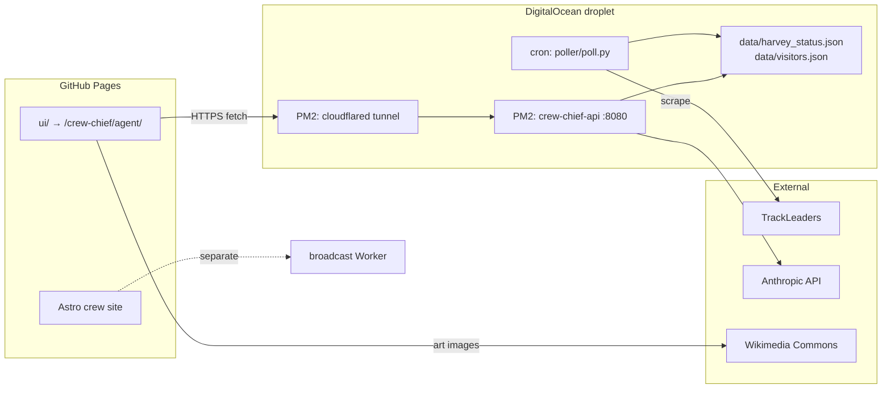

# Sigma Architecture Snapshot — Crew Chief Agent 2.0

**Last updated:** 2026-05-31  
**Status:** Phase 2 in progress (droplet live, chat working; tunnel → Pages wiring in flight)

---

## 1) Problem Statement

- **What is changing?** Harvey's Tahoe 200 crew/family site gains a conversational **Ask Harvey** agent: live chat grounded in TrackLeaders position data, deployed as static UI on GitHub Pages with a small Python API on a DigitalOcean droplet.
- **Why now?** Race week starts June 12, 2026. Family and crew need a low-friction way to ask "how is he doing?" without reading raw tracker pages. The droplet is provisioned and chat is live; remaining work is hardening ops, tunnel stability, and race-week monitoring.

---

## 2) Success Criteria

- Family opens `https://harveygerardMK.github.io/crew-chief/agent/` on a phone, onboards once, and gets **non-fallback** Harvey replies within ~10s.
- `/status` reflects poller output; stale GPS is surfaced in UI without breaking chat.
- Droplet survives reboot (PM2 + cron); tunnel URL is documented and wired to `PUBLIC_AGENT_API_URL`.
- `./scripts/verify-agent.sh <tunnel-url>` passes; `./scripts/check-agent-env.sh` passes on the droplet before race week.
- Mac mini failover runbook is executable if the droplet fails during the race.

---

## 3) Scope

**In scope:**

- `poller/` → `data/harvey_status.json`
- `server/` FastAPI (`/health`, `/ready`, `/status`, `/visitors`, `/chat`)
- `ui/` → copied to `public/agent/` at build → `/crew-chief/agent/` on Pages
- Droplet bootstrap, PM2, Cloudflare quick tunnel, GitHub Actions variable
- Voice prompt (`voice.md`), fallback copy (`server/fallback.md`)

**Out of scope (separate systems):**

- Astro crew site content (`src/`, `data/*.json` for static pages)
- Broadcast Worker (`workers/broadcast/`) — crew photo/update form
- Real-time WebSockets, database, user accounts beyond visitor UUID in JSON

---

## 4) Constraints

- **Static-first:** UI is static files; no SSR for chat.
- **No database:** visitors + status are JSON files on disk.
- **Budget:** $5/mo droplet; Anthropic API pay-as-you-go.
- **Security:** API key only on droplet; never in GitHub Pages build artifacts except the public tunnel URL.
- **HTTP headers:** API keys must be ASCII-only (smart quotes / em dashes break httpx).
- **Python 3.10+** on Ubuntu 22.04 droplet.

---

## 5) System Boundaries



**Inputs:** visitor name/relationship, chat messages, TrackLeaders HTML, `voice.md`, env secrets.

**Outputs:** JSON chat replies + art prompts, status JSON, optional visitors backup to GitHub.

**External dependencies:** Anthropic, TrackLeaders, Cloudflare Tunnel, GitHub Pages, Wikimedia (art thumbnails).

---

## 6) Core Components

| Component | Responsibility | Interface |
|-----------|----------------|-----------|
| **Poller** (`poller/`) | Fetch runner snapshot every 5 min | Writes `harvey_status.json` |
| **API** (`server/app.py`) | REST chat + status | `GET /health`, `GET /ready`, `GET /status`, `POST /visitors`, `POST /chat` |
| **Claude layer** (`server/claude.py`) | LLM call + JSON parse | Returns `{reply, art_prompt}` or raises `ClaudeError` → fallback |
| **Prompt builder** (`server/prompt.py`) | System prompt from voice + status + visitor | Injects mile, relationship, race phase |
| **Visitors** (`server/visitors.py`) | UUID registry + check-ins | JSON file; optional GitHub export |
| **Chat UI** (`ui/app.js`) | Onboarding, chat, status bar, art cards | `window.CREW_CHIEF_API` from build |
| **Build bridge** (`scripts/copy-ui.mjs`) | Inject API URL at Astro prebuild | `PUBLIC_AGENT_API_URL` GitHub variable |
| **Deploy** (`deploy/ecosystem.config.cjs`) | PM2 process definitions | API + cloudflared |
| **Verify** (`scripts/verify-agent.sh`) | End-to-end API smoke test | Run from laptop against tunnel URL |

---

## 7) Data Contracts

### `harvey_status.json`

Key fields: `enabled`, `race_status`, `route_mile`, `current_speed_mph`, `stale` (GPS >2h), `data_stale` (poller fetch failed), `fetched_at`, `error`.

### `POST /visitors`

```json
{ "name": "Amanda", "relationship": "family" }
```

Relationships: `family | friend | crew | pacer | stranger`.

### `POST /chat`

```json
{ "visitor_id": "uuid", "message": "optional" }
```

Response:

```json
{
  "reply": "...",
  "art_prompt": "Title, Artist — caption",
  "harvey_status_snapshot": { ... },
  "fallback": false
}
```

`fallback: true` means Claude failed (missing key, credits, network, bad key encoding) — static copy from `fallback.md`.

---

## 8) Flow of Control

1. **Build:** `npm run prebuild` → `copy-ui.mjs` writes `public/agent/config.js` with `CREW_CHIEF_API`.
2. **Pages deploy:** static UI served; browser calls tunnel URL for API.
3. **Onboarding:** UI `POST /visitors` → stores `visitor_id` in `localStorage`.
4. **Greeting:** UI `POST /chat` (no message) → server builds prompt → Claude → reply + art.
5. **Chat turn:** same with user message; `record_checkin` updates visitor JSON.
6. **Status poll:** UI `GET /status` every 60s; poller refreshes file every 5 min via cron.

---

## 9) Failure Modes and Recovery

| Failure | User-visible | Recovery |
|---------|--------------|----------|
| Invalid / non-ASCII API key | Fallback message | Re-paste key in `server/.env`; run `check-agent-env.sh`; `pm2 restart crew-chief-api` |
| Anthropic credits exhausted | Fallback | Add credits at console.anthropic.com |
| Tunnel URL changed | Chat fails entirely | Restart cloudflared; update `PUBLIC_AGENT_API_URL`; redeploy Pages |
| Poller misconfigured | Status "unknown", stale banner | Edit `poller/.env` slug/name; manual `python3 poll.py` |
| Droplet down | UI offline message | Mac mini failover runbook |
| TrackLeaders GPS gap | Stale banner; chat still works | Expected in canyons — no action |

---

## 10) Implementation Plan (phase slices)

| Slice | Phase | Status |
|-------|-------|--------|
| Poller + server + UI merged to `main` | 1 | Done |
| Ask Harvey link on crew site | 1 | Done |
| `PUBLIC_AGENT_API_URL` GitHub variable | 1–2 | **Ops — verify set** |
| Droplet bootstrap + PM2 API | 2 | Done (live) |
| Anthropic key + live chat | 2 | Done |
| PM2 cloudflared + tunnel URL → Pages | 2 | **In progress** |
| `/ready` ops endpoint + env check script | 2 | This slice |
| Poller cron + live TL slug | 2–4 | Pre-race: `copper26` test; race: `tahoe20026` |
| `voice.md` approval + 3 testers | 3 | Pending |
| Failure drills + code freeze Jun 10 | 4 | Pending |
| Race weekend monitoring | 5 | Pending |

---

## 11) Verification Plan

```bash
# On droplet
curl -s http://127.0.0.1:8080/health
curl -s http://127.0.0.1:8080/ready | python3 -m json.tool
bash scripts/check-agent-env.sh

# From laptop
./scripts/verify-agent.sh https://YOUR-TUNNEL.trycloudflare.com

# CI
# .github/workflows/agent-tests.yml on server/ + poller/ changes
```

Manual: phone test onboarding + chat + art card; confirm `fallback: false` in verify output.

---

## 12) Open Questions and Assumptions

- **Assumption:** Quick Cloudflare tunnel under PM2 is acceptable for v1; named tunnel before race week if URL stability becomes an issue.
- **Assumption:** Port **8080** is canonical (some early droplet setups used 8000 — align with `deploy/ecosystem.config.cjs`).
- **Open:** Whether to wire NGA art pairings JSON into server-side art selection vs. current Wikimedia search from `art_prompt` text.
- **Open:** GitHub backup of `visitors.json` — nice-to-have, not required for race.

---

## Related docs

- Deploy: `docs/superpowers/runbooks/crew-chief-agent-deploy.md`
- Phase tracker: `docs/crew-chief-agent-status.md`
- Preflight: `docs/superpowers/runbooks/crew-chief-agent-preflight.md`
- Failover: `docs/superpowers/runbooks/crew-chief-agent-failover-mac-mini.md`
